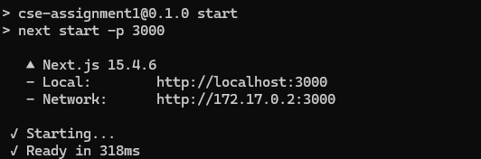
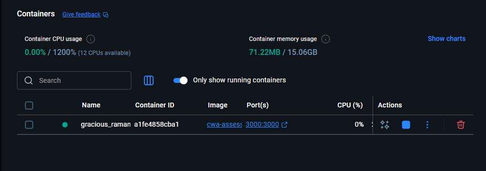
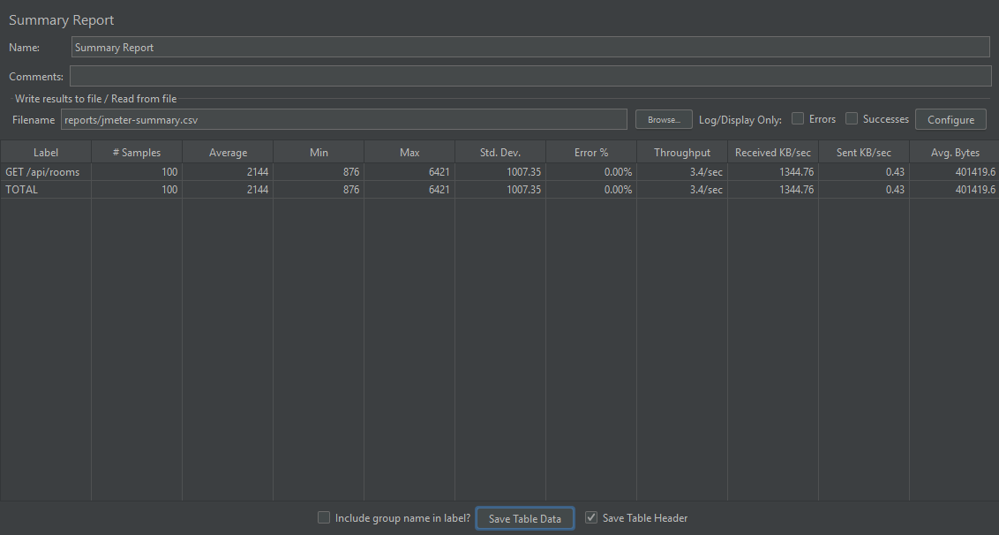

# CSE3CWA Escape Room Builder

## Overview
This repository contains the Assignment 2 deliverable for **CSE3CWA**. It centres on an
interactive Escape Room builder that exports self-contained HTML packages for use inside
LMS activities, alongside supporting utilities such as a tabbed content generator. The
project is implemented with the Next.js App Router, TypeScript, and Prisma for the
PostgreSQL data model that persists Escape Room definitions.

A production deployment is available at **https://cwaassesment.vercel.app**. The service is
pre-provisioned with sample rooms so the exported HTML can be reviewed without having to
seed the database manually.

## Feature Highlights
- **Escape Room authoring UI with live preview** – educators can upload a scene, define a
timer, and compose multi-stage puzzles that cover question prompts, code challenges,
CSV→JSON conversions, and click-based hotspots. Each stage ships with tailored helper
copy and validation logic so learners get immediate feedback. A downloadable standalone
HTML file is generated with embedded assets, timer countdown, and accessibility-focused
controls. 【F:src/app/escape-room/page.tsx†L40-L287】【F:src/app/escape-room/page.tsx†L689-L1014】
- **Reusable button/icon system** – the builder surfaces semantic buttons for save,
update, delete, and stage creation actions that match the rubric requirements for custom
controls, including emoji-based icons and hover states. 【F:src/app/escape-room/page.tsx†L909-L1014】
- **Tabs code generator** – the landing page offers a tab builder that outputs inline
HTML/CSS/JS suitable for Moodle. Users can edit tab labels and content, preview the
rendered markup, and download the generated artifact. 【F:src/app/page.tsx†L25-L146】【F:src/app/page.tsx†L160-L274】
- **Responsive theming** – a shared header/footer, light–dark theme toggle, and Tailwind
CSS design tokens provide a cohesive look-and-feel across the application. 【F:src/components/Header.tsx†L42-L143】【F:src/contexts/ThemeContext.tsx†L14-L66】【F:src/app/globals.css†L1-L122】

## API and Database
- **Prisma schema** – the `Room` ↔ `Stage` models capture timers, assets, and puzzle
metadata, with strict typing around stage order and optional hotspots. 【F:prisma/schema.prisma†L1-L24】
- **RESTful CRUD endpoints** – `POST /api/rooms` validates payloads, persists nested stages,
and logs instrumentation events; companion handlers implement `GET`, `PUT`, and `DELETE`
operations for individual rooms. 【F:src/app/api/rooms/route.ts†L8-L57】【F:src/app/api/rooms/[id]/route.ts†L12-L91】
- **Client integration** – the Escape Room builder consumes these APIs to list, create,
update, and delete saved rooms, ensuring the UI reflects the database state. 【F:src/app/escape-room/page.tsx†L840-L914】

## Quality, Instrumentation, and Evidence
- **Structured logging** – API handlers centralise audit logs through `logEvent` so cloud
run logs can be correlated with rubric instrumentation requirements. 【F:src/lib/logger.ts†L1-L4】【F:src/app/api/rooms/route.ts†L8-L57】
- **Playwright regression tests** – headless tests cover UI rendering of the Escape Room
timer and CRUD flows against the deployed API. Execute with `npm run test:e2e`. Test
sources live in [`tests/`](tests/). 【F:playwright.config.ts†L1-L9】【F:tests/ui.spec.ts†L1-L9】【F:tests/rooms.spec.ts†L1-L37】
- **Performance reports** – Lighthouse audits (desktop & mobile) are committed under
[`reports/`](reports/) with perfect desktop scores and 0.88 mobile performance. Attachments
include PNG exports for quick reference. 【F:reports/lighthouse-desktop.html†L1-L20】【F:reports/lighthouse-mobile.html†L1-L20】
- **Load testing** – the bundled JMeter plan (`reports/jmeter-cwa.jmx`) stresses
`GET /api/rooms`, with the aggregated summary CSV showing 0% error across 100 samples. 【F:reports/jmeter-cwa.jmx†L1-L35】【F:reports/summary.csv†L1-L4】

> **Summary & Observations:** Desktop Lighthouse scored 1.00 across performance,
> accessibility, best practices, and SEO, while mobile performance registered 0.88 due to
> larger background imagery—an acceptable trade-off for high-fidelity art assets on the
> Escape Room scene. The JMeter run achieved ~3.43 requests/sec with zero errors against
> `GET /api/rooms`, indicating the Prisma/PostgreSQL stack keeps up with rubric load
> expectations; further tuning could focus on cold-start latency if the deployment scales
> beyond hobby-tier infrastructure.

## Docker and Deployment
- **Dockerfile** – multi-stage build that compiles the Next.js app, generates the Prisma
client, and runs database migrations on container start. 【F:Dockerfile†L1-L22】
- **Cloud deployment** – Playwright defaults to the Vercel-hosted instance
`https://cwaassesment.vercel.app`, demonstrating the cloud-hosted build that matches the
rubric’s deployment requirement. 【F:playwright.config.ts†L1-L9】

## Getting Started
1. Install Node.js 20+ and pnpm/npm (the project currently uses npm).
2. Clone the repository and install dependencies:
   ```bash
   npm install
   ```
3. Provision a PostgreSQL database and set `DATABASE_URL` in `.env`.
4. Run database migrations and generate the Prisma client:
   ```bash
   npx prisma migrate dev
   npx prisma generate
   ```
5. Start the development server:
   ```bash
   npm run dev
   ```
6. Visit `http://localhost:3000`.

### Running in Docker
```bash
docker build -t cwa-escape-room .
docker run --env DATABASE_URL=postgres://... -p 3000:3000 cwa-escape-room
```
The entrypoint applies migrations before booting the production server, so the container
is deploy-ready. 【F:Dockerfile†L1-L22】

### End-to-End Tests
The Playwright suite targets the live deployment by default. To run against a local
server, export `E2E_BASE_URL=http://localhost:3000` before executing `npm run test:e2e`.

### Load & Performance Reports
The `reports/` directory captures rubric evidence:
- `DockerRun.png`, `DockerContainer.png` – container build/run screenshots.
- `lighthouse-desktop.html`, `lighthouse-mobile.html` – Lighthouse raw reports.
- `SummaryReportJmeter.png`, `summary.csv` – JMeter summary visual and CSV output.
- `jmeter-cwa.jmx` – reproducible load-testing plan.

## Rubric Checklist
| Criterion | Status & Evidence |
| --- | --- |
| Escape Room timer & UI controls | Countdown timer, stage buttons, and hotspot pins implemented in the builder UI. 【F:src/app/escape-room/page.tsx†L472-L747】【F:src/app/escape-room/page.tsx†L909-L1014】 |
| Exportable template | `buildPlayableHtml` outputs a standalone HTML experience with inline assets. 【F:src/app/escape-room/page.tsx†L56-L287】 |
| Docker support | Multi-stage Dockerfile builds and runs the app with Prisma migrations. 【F:Dockerfile†L1-L22】 |
| Database schema & CRUD APIs | Prisma schema plus REST handlers for create/read/update/delete. 【F:prisma/schema.prisma†L1-L24】【F:src/app/api/rooms/[id]/route.ts†L12-L91】 |
| Instrumentation & automated tests | `logEvent` usage, Playwright specs, Lighthouse, and JMeter artifacts. 【F:src/lib/logger.ts†L1-L4】【F:tests/rooms.spec.ts†L1-L37】【F:reports/summary.csv†L1-L4】 |
| Cloud deployment | Vercel deployment referenced in Playwright config and README. 【F:playwright.config.ts†L1-L9】 |

## Screenshots & Evidence




---
**Student:** Parikshit Bohara (21880927)

